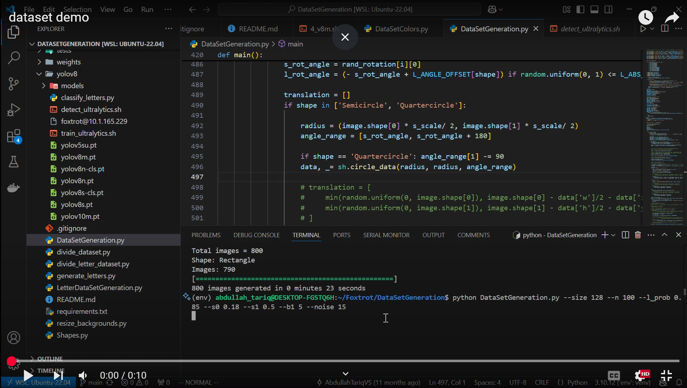
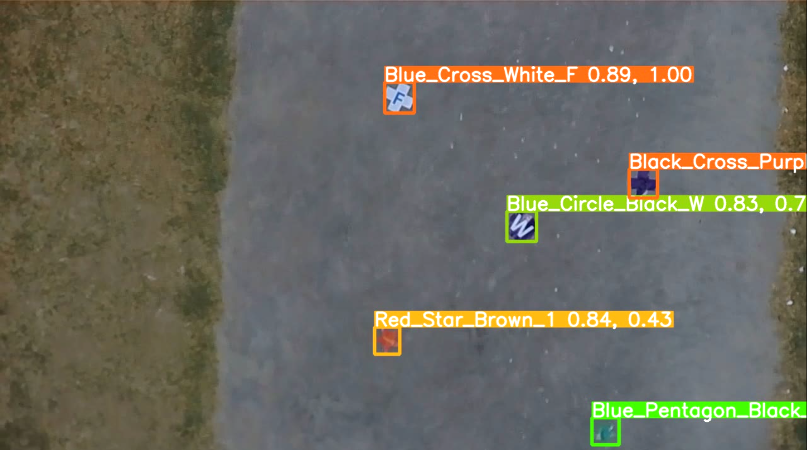
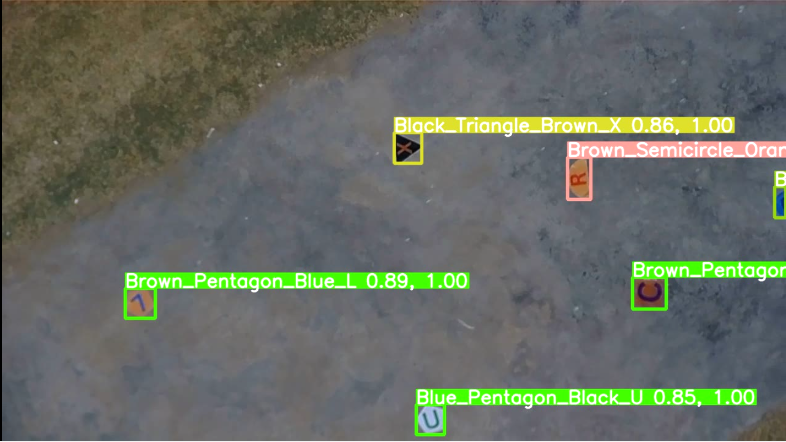
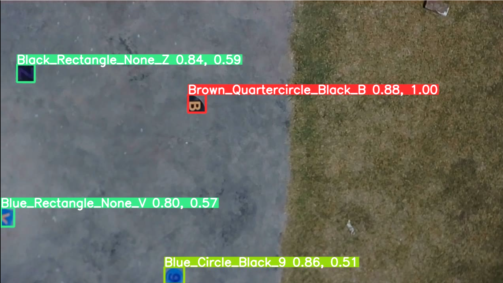
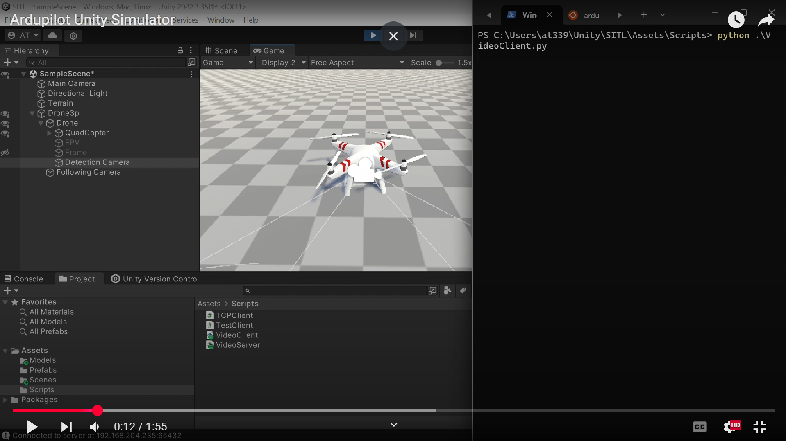

# **Detection Model Dataset Generator & YOLOv8-Based UAV Detection**

## **Overview**
This project focuses on developing an end-to-end pipeline for generating synthetic datasets and training a UAV-based shape and letter detection model using YOLOv8. The project consists of two main components:

1. **Dataset Generator for a Detection Model** – A Python-based synthetic dataset generator using OpenCV and NumPy.
2. **YOLOv8-Based Shape & Letter Detection on UAV** – A custom-trained YOLOv8 model deployed on a Jetson Orin for real-time UAV detection.

---

## **1. Dataset Generator for a Detection Model**
### **Objective**
To create a high-quality synthetic dataset for training a shape detection model for UAV applications, ensuring diverse object placements and realistic backgrounds.

### **Features**
- **Automated Shape Placement:** Uses NumPy for vertex generation, transformations, and positioning.
- **Realistic Dataset Creation:** Integrates OpenCV for background blending to create natural-looking images.
- **High-Speed Generation:** Produces **24,000 images in just 3 minutes**, significantly accelerating model training.

### **Implementation Details**
- **Shapes Generated:** Circles, , triangles, and polygons.
- **Randomized Parameters:** Position, rotation, scale, noise, blur and background textures.
- **Libraries Used:** OpenCV for image processing, NumPy for mathematical transformations, and multiprocessing for faster image generation.

### **Usage**
1. Run the following command to install all the dependencies
    ```bash
    pip install -r requirements.txt
    ```
2. Run the following command to see all the parameters (variables) you can adjust to generate your dataset 
    ```bash
    python DataSetGeneration.py --help
    ```
3. After selecting the values, run the command with those parameters
    ```bash
    python DataSetGeneration.py --<parameter_name> <parameter_value>

    #Examples
    #Command for generating 100 images per shape of 120x120px
    python DataSetGeneration.py --n 100 --size 120
    
    #Configuration used in SUAS2024
    python DataSetGeneration.py --size 128 --n 2000 --l_prob 0.85 --s0 0.18 --s1 0.5 --b1 5 --noise 15 
    ```
4. Your dataset will be stored in the output folder
Here is a short demonstration of the script

[](https://www.youtube.com/watch?v=M6aMvx-366g)

*The script is running on the CPU instead of the GPU, resulting in slower performance.*
---

## **2. YOLOv8-Based Shape & Letter Detection on UAV**
The previous command was achieved through extensive experimentation to generate the most realistic dataset that met the requirements. A YOLOv8 model was then trained separately for **(a) shape detection** and **(b) letter recognition**. The following images showcase the final results.





---

## **Results & Performance**
- **Dataset Quality:** The synthetic dataset improved the model's generalization ability.
- **Detection Accuracy:** Achieved **93% mAP** across different lighting and background conditions.
- **Real-Time Processing:** The optimized model runs at **30 FPS** on Jetson Orin.

---

## **Simulation for Testing**
To test the whole pipline, i developed a 3d environment in Unity to visualize the ardupilot simulator, giving a visual feed for testing the model detection, and autmoation scripts

[](https://youtu.be/kaauHcKhMOU?si=Xqrb-vp8SKQsXiG2&t=12)